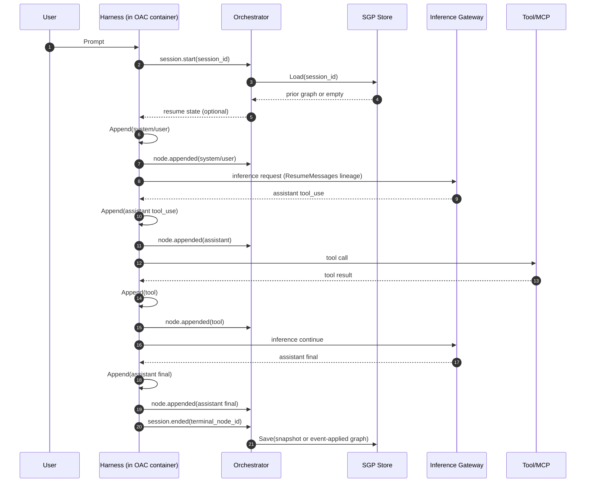
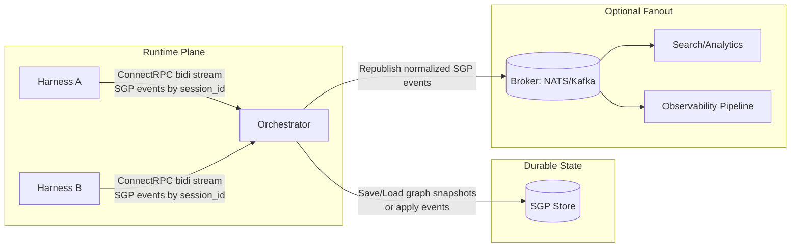
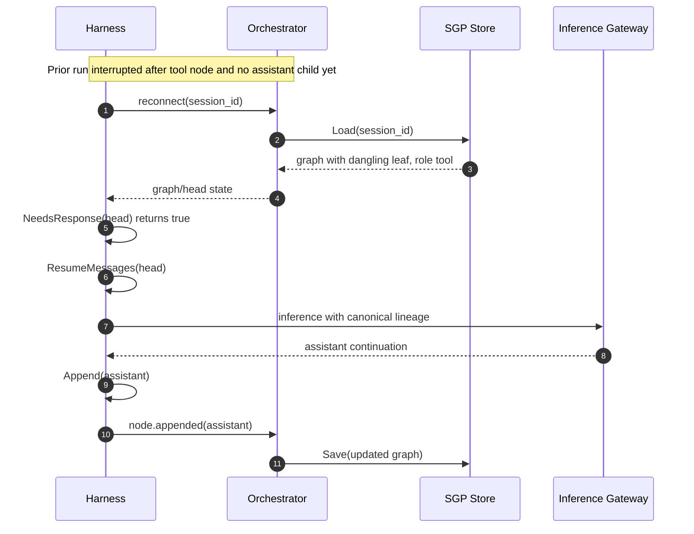
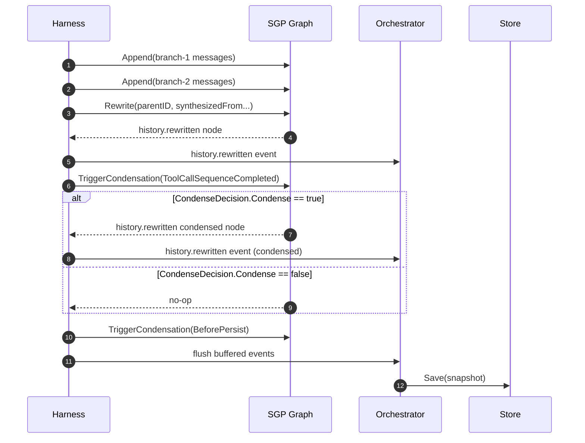
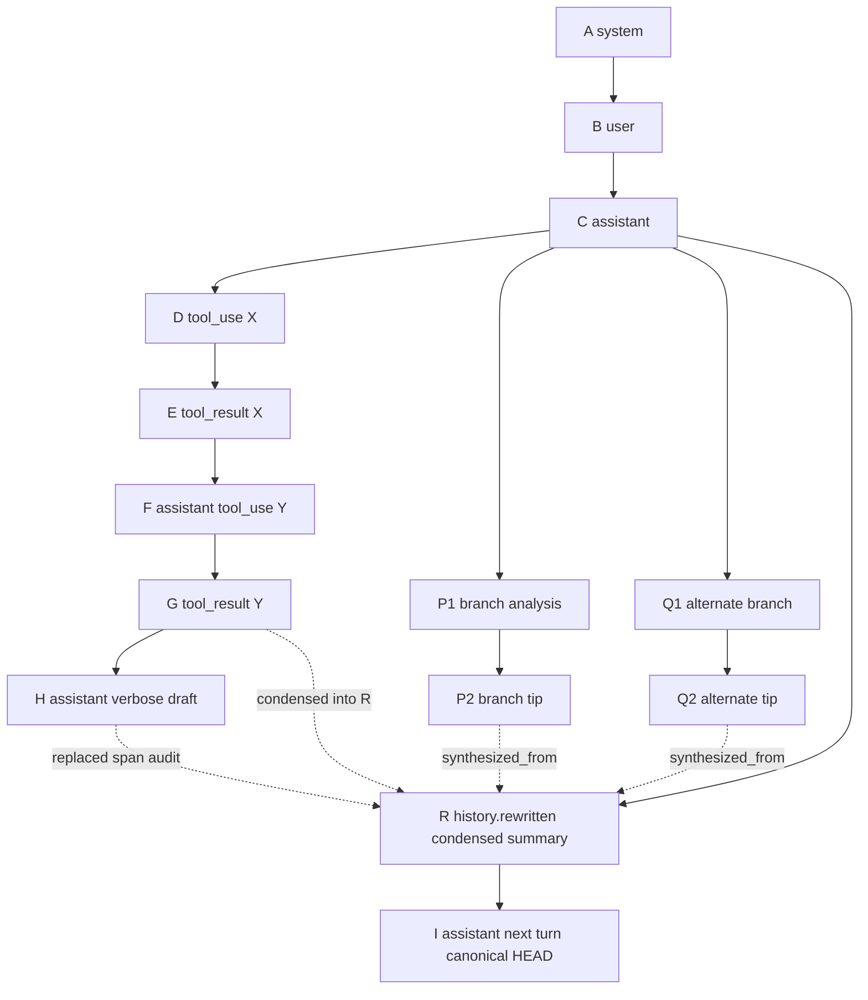

# Session Graph Protocol

Session Graph Protocol (SGP) is a way to represent agent sessions as append-only directed acyclic graphs instead of flat transcripts.

The protocol is designed for agent harnesses and orchestrators that need to:

- resume from partial progress without replaying completed work,
- preserve parallel branches and history rewrites,
- record subagent provenance,
- persist session state outside process memory,
- and reconstruct the exact canonical message history for inference.

This repository provides a publishable Go package at `github.com/restrukt-ai/sessiongraphprotocol` that implements those primitives.

## Protocol Model

SGP treats every inference message as an immutable node.

- Canonical edges (`parent_ids`) define the resumable session history.
- Audit edges (`synthesized_from`, `spawned_from`) preserve provenance but are not followed during resumption.
- A rewrite does not mutate prior nodes. It appends a new canonical node that references the previous branch tips through audit edges.

That lets a harness recover from interruptions, branch work in parallel, and retain the full history of how a result was produced.

## Package Capabilities

The Go package currently provides:

- typed SGP data structures such as `Session`, `Node`, `Message`, and `Event`,
- an in-memory `Graph` API for building and resuming sessions,
- configurable event names through `EventKind` and `EventNames`,
- trigger-based context condensation hooks for harness-managed summarization,
- a persistence `Store` interface for pluggable backends,
- snapshot versioning and upgrade support,
- and a flat JSON file store for local disk persistence.

## Installation

```bash
go get github.com/restrukt-ai/sessiongraphprotocol
```

## Core Usage

Create a graph, append nodes as the harness progresses, and use the canonical lineage when you need to resume inference.

```go
package main

import (
	"fmt"

	sgp "github.com/restrukt-ai/sessiongraphprotocol"
)

func main() {
	graph := sgp.NewGraph()

	root, _, err := graph.Append(sgp.Message{
		Role:    sgp.MessageRoleSystem,
		Content: "You are a helpful agent.",
	}, nil)
	if err != nil {
		panic(err)
	}

	userNode, _, err := graph.Append(sgp.Message{
		Role:    sgp.MessageRoleUser,
		Content: "Summarize the latest build failures.",
	}, nil, root.ID)
	if err != nil {
		panic(err)
	}

	assistantNode, _, err := graph.Append(sgp.Message{
		Role:    sgp.MessageRoleAssistant,
		Content: "I found three failures.",
	}, map[string]any{"model": "gpt-5.4"}, userNode.ID)
	if err != nil {
		panic(err)
	}

	resumeMessages, err := graph.ResumeMessages(assistantNode.ID)
	if err != nil {
		panic(err)
	}

	fmt.Println(len(resumeMessages))
}
```

## Rewrites And Branches

When the harness explores multiple branches and wants to collapse them into a new canonical result, use `Rewrite`.

```go
rewriteNode, event, err := graph.Rewrite(
	sgp.Message{Role: sgp.MessageRoleAssistant, Content: "Merged result"},
	nil,
	canonicalParentID,
	branchTipOne,
	branchTipTwo,
)
```

The rewrite node becomes the new canonical head, while the synthesized branch tips remain preserved as audit history.

## Pending Response Detection

SGP is built to help harnesses recover after interruption. If the current leaf is a `user` or `tool` node with no child, the graph can tell you that a response is still pending.

```go
needsResponse, err := graph.NeedsResponse(nodeID)
```

This is useful when a harness restarts and needs to determine whether it should re-submit inference instead of replaying already-completed work.

## Event Names

The package does not scatter hard-coded event strings through the API. Event kinds are stable enums, and the actual emitted names are configurable in one place.

```go
graph := sgp.NewGraph(
	sgp.WithEventNames(sgp.EventNames{
		SessionStart:     "sgp.session.started",
		NodeAppended:     "sgp.node.appended",
		HistoryRewritten: "sgp.history.rewritten",
		SessionEnded:     "sgp.session.ended",
	}),
)
```

This lets you keep call sites stable even if the wire-format event strings change later.

## Context Condensation

The package supports trigger-based context condensation while keeping condensation semantics in the
harness (where model/prompt/tool specifics live).

SGP itself does not perform semantic compaction and does not pick rewrite parents or merge sources.
The harness decides what to condense, where to branch from, and which tips to synthesize.

### Condensation Triggers

The graph exposes typed triggers instead of hard-coded strings:

- `CondenseTriggerManual`
- `CondenseTriggerToolCallSequenceCompleted`
- `CondenseTriggerBeforePersist`

Register a condenser for a trigger with `WithCondenser`, then invoke it with
`TriggerCondensation` when your harness reaches that lifecycle point.
When `CondenseDecision.Condense` is true, the harness must provide both `ParentID` and
`SynthesizedFrom`; Graph only validates and appends the resulting rewrite node.

```go
graph := sgp.NewGraph(
	sgp.WithCondenser(
		sgp.CondenseTriggerToolCallSequenceCompleted,
		func(input sgp.CondenseInput) (sgp.CondenseDecision, error) {
			// Harness decides if and how to condense.
			if len(input.Lineage) < 6 {
				return sgp.CondenseDecision{Condense: false}, nil
			}

			return sgp.CondenseDecision{
				Condense:        true,
				ParentID:        input.Lineage[1].ID,
				SynthesizedFrom: []sgp.ID{input.Lineage[len(input.Lineage)-2].ID, input.Head.ID},
				Message: sgp.Message{
					Role:    sgp.MessageRoleAssistant,
					Content: "Summarized tool-call sequence.",
				},
				Metadata: map[string]any{"strategy": "tool-batch-summary"},
			}, nil
		},
	),
)

node, event, condensed, err := graph.TriggerCondensation(
	sgp.CondenseTriggerToolCallSequenceCompleted,
)
_ = node
_ = event
_ = condensed
_ = err
```

When condensation is applied, SGP records it as a `history.rewritten` event/node with
`synthesized_from` provenance.

## Persistence Interface

Persistence is intentionally abstracted behind a small interface so orchestrators and operators can store session graphs in any backing system they choose.

```go
type Store interface {
	Save(ctx context.Context, graph *Graph) error
	Load(ctx context.Context, sessionID ID) (*Graph, error)
}
```

The package also exposes:

- `Graph.Snapshot()` to obtain the serializable form,
- `RestoreGraph(snapshot)` to rebuild an in-memory graph,
- and `UpgradeSnapshot(snapshot)` to validate and migrate supported snapshot versions before restore.

## JSON File Store

For a simple local backend, use `JSONFileStore`.

```go
package main

import (
	"context"

	sgp "github.com/restrukt-ai/sessiongraphprotocol"
)

func main() {
	ctx := context.Background()

	store, err := sgp.NewJSONFileStore("./data/sgp")
	if err != nil {
		panic(err)
	}

	graph := sgp.NewGraph()
	root, _, err := graph.Append(sgp.Message{Role: sgp.MessageRoleSystem, Content: "sys"}, nil)
	if err != nil {
		panic(err)
	}

	_, _, err = graph.Append(sgp.Message{Role: sgp.MessageRoleUser, Content: "hello"}, nil, root.ID)
	if err != nil {
		panic(err)
	}

	if err = store.Save(ctx, graph); err != nil {
		panic(err)
	}

	restored, err := store.Load(ctx, graph.Session().ID)
	if err != nil {
		panic(err)
	}

	_ = restored
}
```

The JSON store writes one snapshot per session to local disk. Snapshots are explicitly versioned, and loads fail if the snapshot version is missing or unsupported.

## Snapshot Versioning

The persistence format is versioned through `GraphSnapshot.Version`.

- New snapshots are written at `CurrentGraphSnapshotVersion`.
- Snapshots must include an explicit `version` field.
- `UpgradeSnapshot` provides the upgrade path for explicitly versioned schemas.

This gives the package a clear path for schema evolution without requiring callers to manually rewrite stored session data.

## Intended Integration Pattern

The normal integration pattern is:

1. The harness creates or loads a graph for a session.
2. The harness appends nodes as system, user, assistant, and tool messages occur.
3. The orchestrator or operator persists the graph through a `Store` implementation.
4. On restart or failover, the harness loads the graph, checks the head, and reconstructs the canonical message history through `ResumeMessages`.
5. If the head is a dangling `user` or `tool` leaf, the harness re-submits inference rather than replaying already-finished work.
6. At relevant harness lifecycle points (for example after multi-tool-call sequences), the harness may call `TriggerCondensation` for its configured trigger.

## Communication Patterns

### Baseline OAC + SGP Runtime Flow



### Optional Broker Fanout



### Resume After Interruption



### Rewrite + Condensation Lifecycle



### Git-Tree Rewrite Mental Model



This is analogous to squashing a long section of history into one compact commit.
After rewrite, canonical resume follows `A -> B -> C -> R -> I`, while the long prior
span (`D..H`) and branch tips (`P2`, `Q2`) remain queryable as audit provenance.

## Status

The package currently focuses on the protocol model, in-memory graph operations, persistence abstractions, and a local JSON backend. It does not prescribe a network protocol, database schema, or orchestrator runtime.

See [SGP.md](./SGP.md) for the protocol document.

## ADK + OAC Example

An end-to-end example integrating ADK runtime sessions with SGP JSON persistence lives at [examples/adk-oac-sgp-agent](./examples/adk-oac-sgp-agent).

It includes:

- a custom ADK `session.Service` backed by SGP,
- an in-process OAC v1alpha2 Connect stream client (no sidecar),
- a `codingagent` proof of concept for subagents and rewrite-driven history cleanup,
- unit tests for session lifecycle and persistence behavior,
- and an OAC-labeled Dockerfile plus example event schema.
